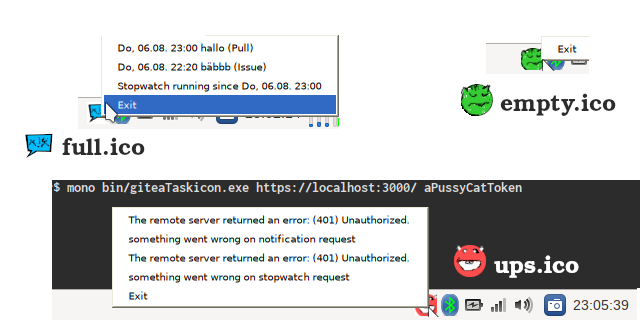

# giteaTaskicon



A cSharp Windows/Linux taskmenu icon app to display (polling every 5min or double click icon):

- unread notifications from gitea every 5min
- is your gitea stopwatch running?

## some notes

```
wget https://repo1.maven.org/maven2/io/swagger/swagger-codegen-cli/2.4.15/swagger-codegen-cli-2.4.15.jar -O swagger-codegen-cli.jar
java -jar swagger-codegen-cli.jar generate -i http://localhost:3000/swagger.v1.json -l csharp -o cs/

nuget install Newtonsoft.Json
msbuild giteaTime.sln
mono bin/giteaTime.exe https://localhost:3000/ app........token
```

the swagger stuff is not used but nice to see!

## Stopwatch(es)

This code shows just a "since" and no additional infos, because default API in gitea 1.12.x has no additional info.
To add more infos take a look to the "master" branch of giteaTime and its `gitea.patch` file.

## Security

http is bad and with a user token you can do a lot!! Thus: use https in gitea!
But: this version ignores ssl errors and warnings (good for self signed certs, but bad on dns attacks).
